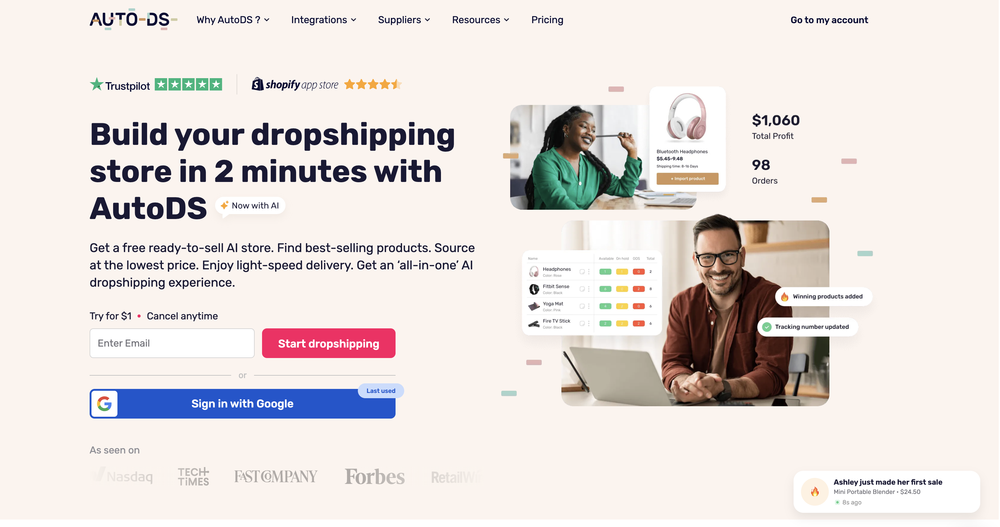

# Improving User Activation and Paid Orders at AutoDS

## Read the full case

➡️ **[Open the case study](solution.md)**

## Overview

The objective was to analyze the current product experience and propose product and UX improvements based on the company’s business goals (OKRs).

The analysis is based on:

- Publicly available information about AutoDS
- UX audit of the onboarding flow
- Product walkthrough

Disclaimer: Since this case study is based on publicly available information, some assumptions were made regarding user behavior and internal product metrics. 
Where appropriate, I explicitly indicate which hypotheses require validation through analytics or user research.

## Company & Product Context

AutoDS is an all-in-one dropshipping automation platform that helps merchants manage the entire dropshipping workflow, including:

- Product research
- Product importing
- Inventory and price monitoring
- Order fulfillment
- Customer support automation
- Pricing optimization

The assignment states that most AutoDS customers are beginners who are just starting their dropshipping journey.

However, after exploring the onboarding flow, I observed that users are immediately asked to connect an existing selling channel (Shopify, WooCommerce, eBay, Amazon, Wix, etc.). This suggests that many users are already at least partially engaged in e-commerce and are looking for automation rather than education.

This discrepancy is important because it affects onboarding expectations and the amount of guidance users need before experiencing product value.

## Repository structure

- `solution.md` — full description of the solution
- `images/` — schemes and illustrations

